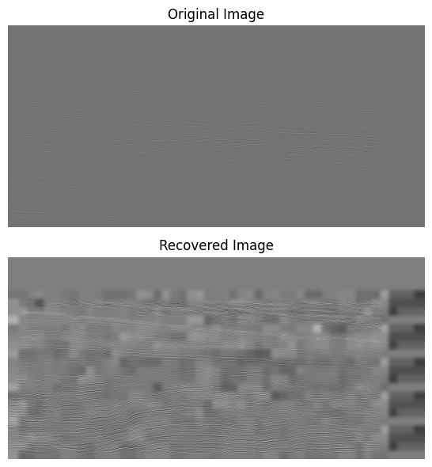

# GAN을 활용한 고해상도 탄성파 이미지 생성

## Exmouth 고원 탄성파 이미지 고해상도 복원 작업(흑백)

## Exmouth 고원 탄성파 이미지 고해상도 복원 작업(컬러)

개선된 Reflecotr(반사면)을 확인할 수 있음.

### MODEL

1. Generator
   고해상도 이미지를 만드는 모델
2. Discriminator
   해당 모델이 고해상도로 복원된 이미지인지 원본이미지인지 판단하는 작업을 진행함.

### TO DO LIST

* [ ] organize the `train.py` code
* [ ] Make and use hyperparameter config.
* [ ] Considering how to handle the checkerboard pattern.
* [ ] Create inference code at the directory level.
* [ ] Compare Fault Detection Score between original seismic vs high-resolution seismic
